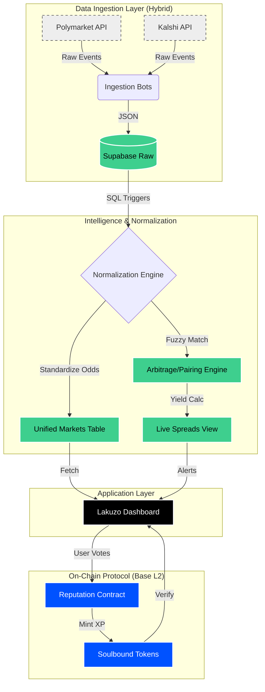

# 🦁 LAKUZO: The Intelligence Layer for Prediction Markets

**The World's 1st Mobile Prediction Market Aggregator.**
*Basically CoinMarketCap + TradingView for Prediction Markets.*

---

## 📉 The Problem: Prediction Markets are Predictable... The Tooling Isn't.

As of late 2025, prediction market volume has surpassed **$4 Billion weekly**. Platforms like Polymarket, Kalshi, and Opinion Labs have found product-market fit.

**But the user experience is stuck in 2013.**
Currently, a trader tracking a major event (like the US Election) has to navigate a fragmented landscape:
* **Polymarket** for global liquidity.
* **Kalshi** for US-regulated contracts.
* **X (Twitter)** for real-time news.
* **Dune Analytics** for volume data.
* **Spreadsheets** to manually calculate arbitrage.

**Lakuzo is the missing link.** We are the single terminal where you can see the truth across all chains and platforms in one view.

---

## 🎯 Who is Lakuzo For?

We are not building for the casual gambler. Lakuzo is professional tooling for:
* **⚡ Arbitrageurs:** Traders who need to spot sub-second price discrepancies between Polymarket and Kalshi.
* **🔍 Market Researchers:** Analysts who need aggregated liquidity and volume data across chain-agnostic sources.
* **📈 Semi-Pros:** High-volume users who have outgrown the basic "Buy Yes/No" interface and need sophisticated charting.

---

## 🚀 Phase 1: Strong Signal Aggregation (Live Now)

We are not a new betting market; we are the intelligence layer that sits on top of them.

### 1. The "CoinMarketCap" Feed
We normalize odds from disparate sources (currently Polymarket & Kalshi) into one standard, real-time feed, allowing for instant cross-platform comparison.

### 2. "Internal" Arbitrage Discovery
In an efficient market, the price of `Yes` + `No` should always equal **$1.00**. However, due to liquidity crunches, these markets frequently break.
* **The Opportunity:** We often see markets where Yes ($0.55) + No ($0.40) = **$0.95**. This is a risk-free 5% yield.
* **The Solution:** Lakuzo’s engine scans for these specific inefficiencies and highlights them instantly.

### 3. The Bundle Workspace
We built the tool that makes manual discovery possible. Users can search for "Bitcoin" and drag charts from both Polymarket and Kalshi into a single "Bundle," creating a custom dashboard to monitor price divergence in real-time.

---

## 🧠 The Insight: Why Social Sentiment is Broken

Existing tools track "Smart Money" by looking at wallet volume. But if a whale spams 300 orders on a 99% odds market, legacy tools count that as "300 Smart Signals." It bloats the data.

### The Solution: The "One Person, One Vote" Reputation Protocol
> **"We measure forecasting skill, not wallet size."**

We introduced a reputation layer entirely on **Base**.
* **Anti-Whale:** You can only vote once per market. Whether you have $10 or $10 Million, your vote counts as one signal.
* **Scoring:** +10 Rep for correct predictions, -10 Rep for incorrect ones. This filters out noise and highlights true forecasters.

---

## 🏗️ System Architecture

Lakuzo uses a **Hybrid Scraper** architecture to balance real-time freshness with API rate limits, anchored by Base for the reputation protocol.

---

## 🔮 Phase 2: Turning Gas into Gold

Phase 2 shifts Lakuzo from a passive "Viewer" to an active "Protocol."

### 1. The Incentive Model
* **The Cost:** Voting requires a transaction on **Base** (~$0.0003).
* **The Pivot:** We turn this "spam tax" into yield. 100% of protocol fees go into a **Seasonal Prize Pool**.
* **The Reward:** At the end of the season, the pot is airdropped to the Top 10 users on the Leaderboard. Bots funding the smartest users.

### 2. The "Pro" Terminal
Integrating a TradingView-style engine that allows users to draw trendlines, RSI, and MACD directly on probability charts.

---

## 🛠️ Challenges We Solved

### 1. The "Zombie Market" Problem
Importing every market made the platform look like a junkyard.
* **The Fix:** We built strict liquidity filters ($5k+ Volume on Poly, 10k+ Contracts on Kalshi) to ensure users only see tradeable markets.

### 2. API Limits vs. Real-Time Needs
You can't arbitrage old data.
* **The Fix:** A **Hybrid Scraper**.
    * *Background:* Safe, steady scraping every 5 minutes.
    * *Foreground:* Atomic Live Refresh triggered instantly when a user views a specific market.

---

## 🌐 Future Ecosystem

By normalizing this fragmented data, Lakuzo becomes an oracle for the Base ecosystem. Developers can build on our Reputation Layer to:
* Create **"Copy-Trade" vaults** based on top-ranked forecasters.
* Mint **dynamic NFTs** that evolve based on forecasting accuracy.
* Feed **"Crowd Wisdom" data** into DeFi protocols for risk modeling.
